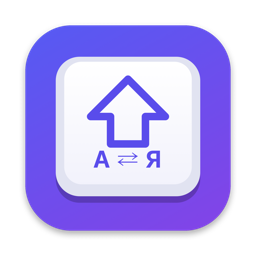

<p align="center">
  
</p>

<h1 align="center">ShiftSwitch</h1>

<p align="center">
  <b>Typed in the wrong layout? Tap Shift.</b><br>
  <code>ghbdtn</code> → <code>привет</code> — the last word is retyped in the other keyboard layout.<br>
  Tiny native macOS menu bar app. Works in Terminal and iTerm2.
</p>

<p align="center">
  <a href="https://github.com/imakarov/shiftswitch/releases/latest"><b>Download</b></a> ·
  <a href="https://imakarov.us/product-shiftswitch.html">Website</a> ·
  <a href="https://github.com/sponsors/imakarov">Sponsor ♥</a>
</p>

---

## Install

**Homebrew**

```bash
brew install --cask imakarov/tap/shiftswitch
```

**Manual:** download `ShiftSwitch-x.y.z.dmg` from [Releases](https://github.com/imakarov/shiftswitch/releases/latest),
drag ShiftSwitch to Applications, launch it.

On first launch macOS asks for **Accessibility** and **Input Monitoring** access
(System Settings → Privacy & Security → Accessibility / Input Monitoring → ShiftSwitch). They are needed to see
keystrokes and to retype the word. Turn on *Launch at Login* in the menu bar icon.

Requires macOS 13 Ventura or later, Apple Silicon or Intel.

## How it works

Type a word, realise it came out in the wrong layout, **tap Shift** (press and release, nothing else) — the word is
erased, retyped in the other layout, and the system layout is switched so you keep typing correctly.
Tap Shift again to undo.

| You do | ShiftSwitch does |
|---|---|
| Short Shift tap after a word | retypes the last word (everything since the last space) in the other layout |
| …with spaces after the word | converts the word, keeps the spaces |
| Select text in an editor or browser field, tap Shift | the whole selection is retyped in the other layout, caret at its end |
| Tap Shift again | converts back |
| Tap Shift with nothing typed | just switches the layout |
| Shift+letter, long Shift hold, Shift+⌘/⌃/⌥, Shift+click | nothing — these are normal Shift uses |

The word buffer is reset by a mouse click, arrows, Home/End/PgUp/PgDn, Return, Tab, Esc, any ⌘/⌃/⌥ shortcut,
switching apps, or switching the layout manually. Backspace edits the buffer.

### Selected text

Select any text in a text field (TextEdit, Notes, Mail, Safari, Chrome, Slack, VS Code…) and tap Shift — the
selection is converted as a whole (`Ghbdtn, vbh!` → `Привет, мир!`), the caret lands at its end so you can keep
typing, and the layout switches. Tap Shift again right away to undo.
The direction is picked from the letters (Latin → other layout, Cyrillic → other layout); digits, emoji and line
breaks are kept.

It never guesses. The selection is converted only when **all** of these hold, otherwise the last word is
converted as usual:

- nothing was typed since the caret last moved — selecting (click, Shift+arrows, ⌘A, double-click) always moves
  it, so an inline autocomplete suggestion while you type is never mistaken for a selection;
- macOS Accessibility reports a non-empty selection in an **editable** field — a selection on a plain web page is
  ignored (typing there would fire the site's keyboard shortcuts);
- the app is not a terminal.

For Chromium/Electron apps ShiftSwitch turns on their accessibility tree (`AXManualAccessibility`) the first time
it looks. Apps that expose no accessibility tree at all (e.g. the ChatGPT desktop app) are handled through a macOS
**Service**: ShiftSwitch presses *App → Services → ShiftSwitch: Convert Layout* in the app's menu bar, the app hands
over its selection on a private pasteboard and replaces it with the converted text. With nothing selected the
service is not called at all, and your clipboard is never touched. The same service is available from the
Services menu (and can get a shortcut in System Settings → Keyboard → Keyboard Shortcuts → Services).

**What it deliberately does not do:** no automatic switching while you type, no dictionaries, no clipboard,
no network access, no telemetry, no keystroke logging. The only thing kept in memory is the last word.

## Why another layout switcher

Punto Switcher (Yandex) and Caramba Switcher both have Shift-based manual conversion, and both regularly fail
in the terminal, drop or swap letters, or trigger by accident. ShiftSwitch was written from scratch around the
failure modes collected from their changelogs, support forums and the issue trackers of open-source analogues:

| Known failure | ShiftSwitch |
|---|---|
| Replacement via *select → ⌘C → ⌘V* breaks in terminals (⌘C is SIGINT there) and clobbers the clipboard | erases with Backspace and retypes; clipboard is never touched |
| Letters that live on punctuation keys (`[ ] ; ' , . \``→ х ъ ж э б ю ё) are cut off as punctuation, so words like «их», «всё», «ещё» don't convert | a word is everything since the last whitespace |
| Hard-coded character tables are wrong for *Russian – PC*, ISO keyboards, US-International dead keys | characters come from your installed layouts via `UCKeyTranslate`; dead keys (`'` `` ` `` `"` `~` `^`) handled |
| Double-Shift false triggers (Shift+Q, space, Shift+W) | a single tap; any key, click or modifier during the press cancels it |
| First letters come out in the old layout / swapped letters after switching | waits for the layout switch to take effect; every synthetic key event also carries its Unicode string |
| Electron apps (Slack, VS Code, Telegram Desktop) drop fast synthetic keystrokes | events are spaced by 1.5 ms |
| With 3+ layouts the "next" layout is the wrong one | toggles to the previously used layout |
| Keys typed right after the tap land in the middle of the word being retyped (first letters stay unconverted) | keys typed during a conversion are held back and replayed in order right after it |
| Event tap silently stops after a system timeout | re-enabled automatically |
| Popup about Secure Input steals focus while you type a password | status is shown by the menu bar icon only |
| Heavy, bundled extras, telemetry | ~300 KB universal binary, ~11 MB RAM, 0% CPU at idle |

### "It doesn't work in my terminal"

If Terminal or iTerm2 has **Secure Keyboard Entry** turned on (iTerm2 also enables it automatically at password
prompts), macOS hides every keystroke from all apps like this one — no layout switcher can work there. ShiftSwitch
shows a 🔒 icon in the menu bar and the menu names the app that holds Secure Input. Turn the option off in that
app's menu (Terminal → Secure Keyboard Entry / iTerm2 → Secure Keyboard Entry).

## Settings

```bash
# Maximum Shift press duration that counts as a tap (default 300 ms)
defaults write us.imakarov.shiftswitch tapThresholdMs -int 250

# Diagnostics log → ~/Library/Logs/ShiftSwitch.log (timings and counts only, never typed text)
defaults write us.imakarov.shiftswitch debugLog -bool YES
```

ShiftSwitch needs two permissions: **Accessibility** (to retype) and **Input Monitoring** (to see keystrokes).
If one is missing, the menu bar icon shows ⚠ and the menu says which one.

## Build from source

```bash
git clone https://github.com/imakarov/shiftswitch && cd shiftswitch
./build.sh install      # universal binary → /Applications/ShiftSwitch.app
```

Single Swift file (`Sources/main.swift`), AppKit + Carbon, no dependencies, no Xcode project — only the Xcode
command line tools. `scripts/release.sh` builds a signed, notarized DMG.

## По-русски

**ShiftSwitch** — исправляет слово, набранное не в той раскладке: короткое нажатие Shift, и `ghbdtn` превращается
в `привет`, а раскладка переключается. Повторное нажатие — отмена. Без автопереключения, без словарей, без сети.
Работает в Terminal и iTerm2 (если там выключен Secure Keyboard Entry). Установка: `brew install --cask
imakarov/tap/shiftswitch` или DMG из [Releases](https://github.com/imakarov/shiftswitch/releases/latest).

## License

MIT © [Ilya Makarov](https://imakarov.us)
